Preview Generator
=================

A small, self-contained C++ generator that renders preview images (1200×630 PNGs) from embedded fonts and a theme system. It is intended to be minimal, fast, and portable across Linux and macOS.

**Highlights**
- Lightweight renderer with embedded fonts and no heavyweight dependencies.
- Outputs PNG images using the bundled `fpng` implementation in `src/vendor/`.
- Runs as a small UNIX-domain-socket (UDS) daemon that accepts simple tab-delimited requests and returns a PNG.

**Quick Start**

Clone and build (Makefile provided):

```
git clone https://github.com/flippedoffbit/preview-generator.git
cd preview-generator
make                # builds the dev target by default
```

After `make` the development binary is written to `out/billpreview`. Use one of the other Make targets below for optimized, sanitizer, profiling or cross-compiled release builds.

**Build Requirements**
- A C++20-capable compiler (`clang++` on macOS, `g++` on Linux) for `make dev`, `make mac`, `make san`, and `make prof`.
- `zig` is required for building cross-compiled static release variants (the Makefile uses `zig c++` to target musl Linux).
- `xxd` is used by the Makefile to convert font files in `assets/` into C headers under `src/gen/` (this is automatic when you run `make`).

**Makefile Targets & Constraints**
- `make dev` — fast local debug/dev build. Output: `out/billpreview` (dynamic-linked, host compiler).
- `make mac` — macOS-optimised build using clang and vector/arch tuning. Output: `out/billpreview-mac`.
- `make san` — build with Address/Undefined sanitizers (`-fsanitize=address,undefined`). Useful for debugging memory errors.
- `make prof` — macOS-optimised build with `-DPROFILE` enabled; prints per-stage timing information when enabled.
- `make release` — cross-compile multiple Linux release variants using `zig` and musl; produces `out/billpreview-<arch>-<variant>` binaries. These builds use aggressive LTO, static linking, and CPU tuning flags and therefore require `zig` and a host capable of running the `zig` tool.

Notes:
- The release builds pass `-static` and other flags that produce fully static musl-linked executables. Use only when you need portable Linux binaries.
- The Makefile will automatically generate header blobs for fonts found in `assets/` (via `xxd -i`) and place them into `src/gen/`.

**Protocol & Usage**

The daemon listens on the UNIX socket `/tmp/billpreview.sock`. The simple protocol is:

- Client → Server: a single request line UTF-8 string terminated by `\n`, with tab-separated fields:
  - `name\tamount\tdate`  OR  `name\tamount\tdate\ttheme_id`  (theme_id optional)

- Server → Client: binary response consisting of:
  1) 4 bytes little-endian PNG size (uint32)
  2) 4 bytes little-endian render time in microseconds (uint32)
  3) PNG bytes (size bytes)

Example: start the daemon (after building):

```
./out/billpreview &
```

A minimal Python client to request a preview and write it to `preview.png`:

```python
#!/usr/bin/env python3
import socket, struct

sock = socket.socket(socket.AF_UNIX, socket.SOCK_STREAM)
sock.connect('/tmp/billpreview.sock')
req = 'Acme Corp\t1234.56\t2026-03-30\n'
sock.sendall(req.encode('utf-8'))

# read the 4+4 header (size, render_us)
hdr = sock.recv(8)
if len(hdr) < 8:
    raise SystemExit('short header')
size, render_us = struct.unpack('<II', hdr)
png = b''
while len(png) < size:
    chunk = sock.recv(size - len(png))
    if not chunk:
        break
    png += chunk
with open('preview.png', 'wb') as f:
    f.write(png)
print('wrote preview.png (size=%d bytes, render_us=%d)' % (size, render_us))

```

You can also use `socat` or other UDS-capable tools to send requests, but binary parsing of the response is required to extract the PNG payload.

**Daemon**

The renderer runs as a small UNIX-domain-socket (UDS) daemon. Default socket: `/tmp/billpreview.sock` (see `SOCKET_PATH` in `src/main.cpp`).

- Start in the foreground (prints logs to stdout):

```
./out/billpreview
```

- Run in the background (simple):

```
./out/billpreview &
```

- Stop the daemon:

```
pkill -f billpreview   # or kill <pid>
```

- If the socket file persists, remove it before restarting:

```
rm -f /tmp/billpreview.sock
```

- Logs: the daemon prints basic request and render timing info to stdout/stderr (e.g. `[ok] listening on /tmp/billpreview.sock`, `[req] name=...`, `[render] 12345 µs`).

- Testing with `socat`: `socat` will dump binary data, so use a small client (see Python example above) or write a short program that reads the 8-byte header then the PNG payload.

- Example systemd unit (optional) — save as `/etc/systemd/system/billpreview.service`:

```
[Unit]
Description=Bill preview UDS daemon
After=network.target

[Service]
Type=simple
WorkingDirectory=/path/to/preview-generator
ExecStart=/path/to/preview-generator/out/billpreview
Restart=on-failure
User=preview

[Install]
WantedBy=multi-user.target
```

Customize `WorkingDirectory`, `ExecStart`, and `User` as appropriate. After creating the unit: `systemctl daemon-reload && systemctl enable --now billpreview`.

**Assets & Fonts**
- Place or update TrueType/OTF fonts under `assets/` (the Makefile expects specific names used by the project: `Fraunces-Bold.ttf`, `DMMono-Medium.ttf`, and `Inter-VariableFont_opsz,wght.ttf`). Running `make` will convert these into generated headers in `src/gen/`.

**Project Structure**
- `assets/` — font and other binary assets used by the generator.
- `src/` — source code and `vendor/` third-party single-file libraries.
- `src/gen/` — generated font headers (created by the Makefile from `assets/`).
- `out/` — build outputs (binaries).

**Developer Notes**
- The renderer uses a small glyph cache (`src/glyph_cache.*`) and `stb_truetype` to rasterize glyphs into a software canvas. PNG encoding is performed by `fpng`.
- `main.cpp` implements a simple UDS daemon; change the socket path at `SOCKET_PATH` in the source if needed.
- For cross-compiling releases, ensure `zig` is installed and on `PATH`.

**Contributing**
- Open issues or PRs for fixes, features, or packaging improvements. Keep changes focused and minimal.

**Examples**

Sample previews generated by the project are included in `test_out/`. Thumbnails are embedded below; click any image to open the full PNG.

<div>
  <a href="test_out/01_rahul.png">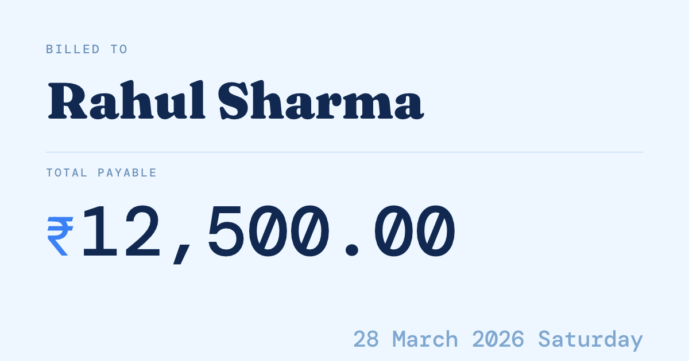</a>
  <a href="test_out/02_priya.png">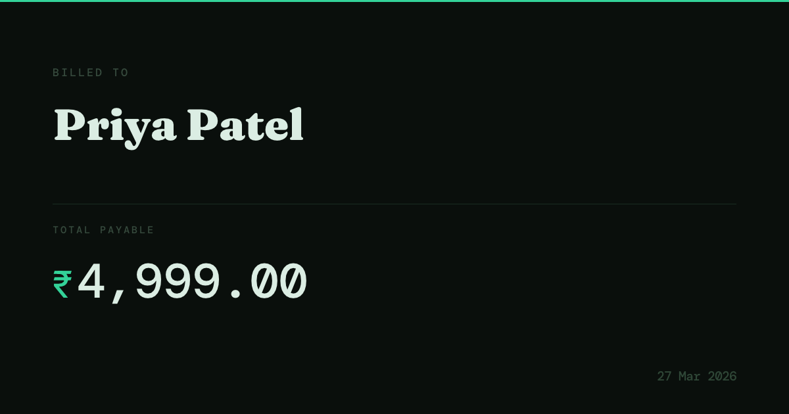</a>
</div>

<div>
  <a href="test_out/03_amit.png">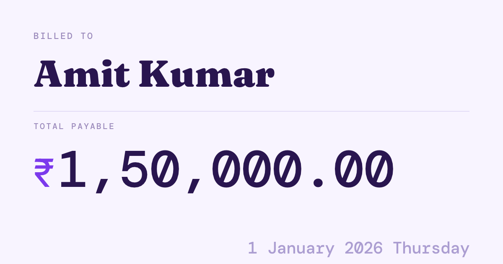</a>
  <a href="test_out/04_infosys_ltd.png">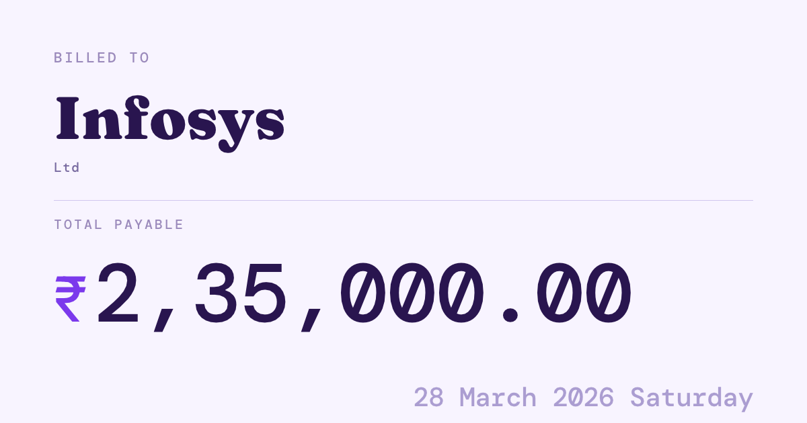</a>
</div>

<div>
  <a href="test_out/05_tcs_limited.png">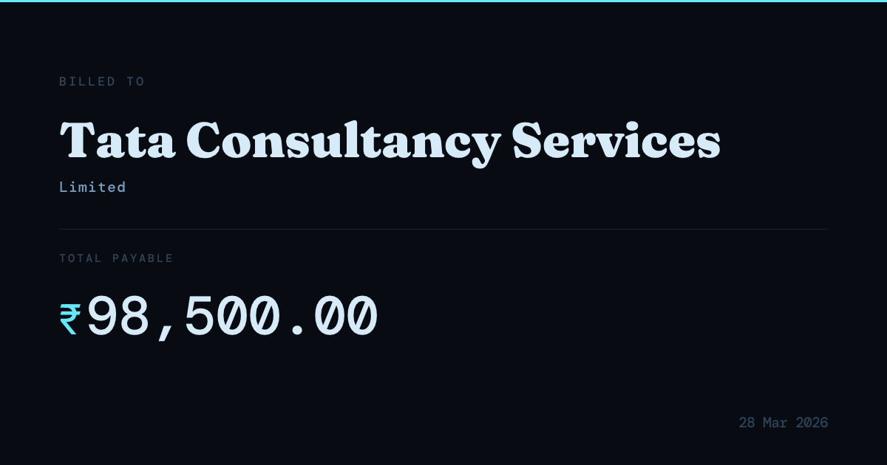</a>
  <a href="test_out/06_zeta_pvtltd.png">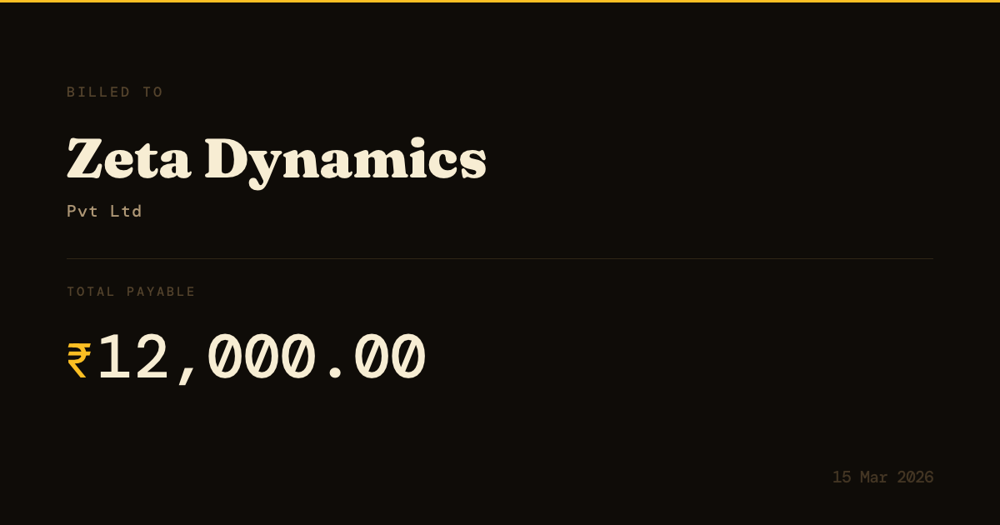</a>
</div>

<div>
  <a href="test_out/07_apex_llc.png">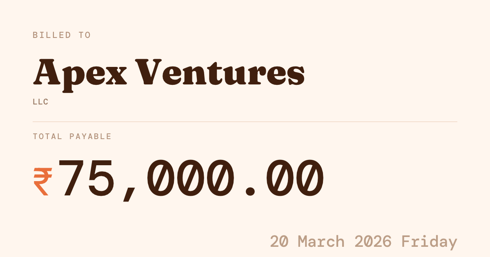</a>
  <a href="test_out/08_blueriver_inc.png">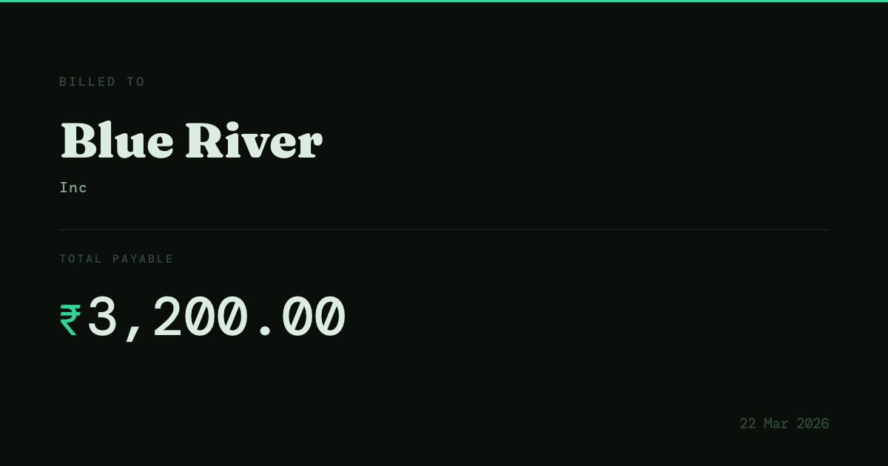</a>
</div>

<div>
  <a href="test_out/09_meridian_llp.png">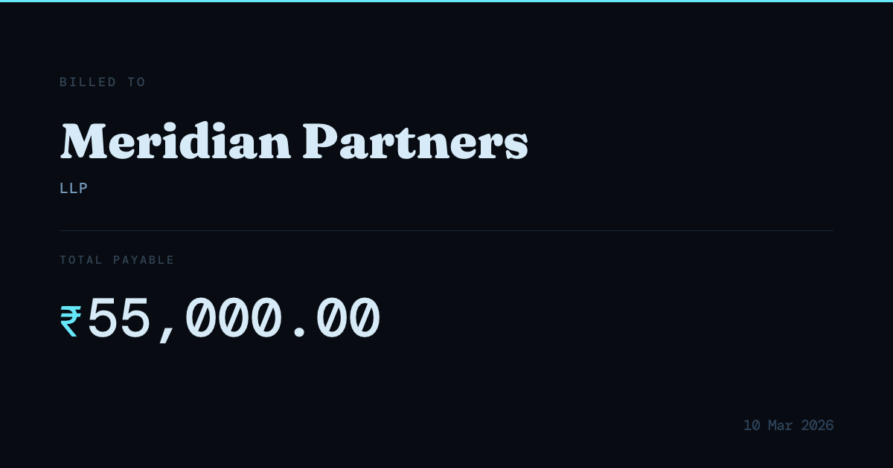</a>
  <a href="test_out/10_overflow.png">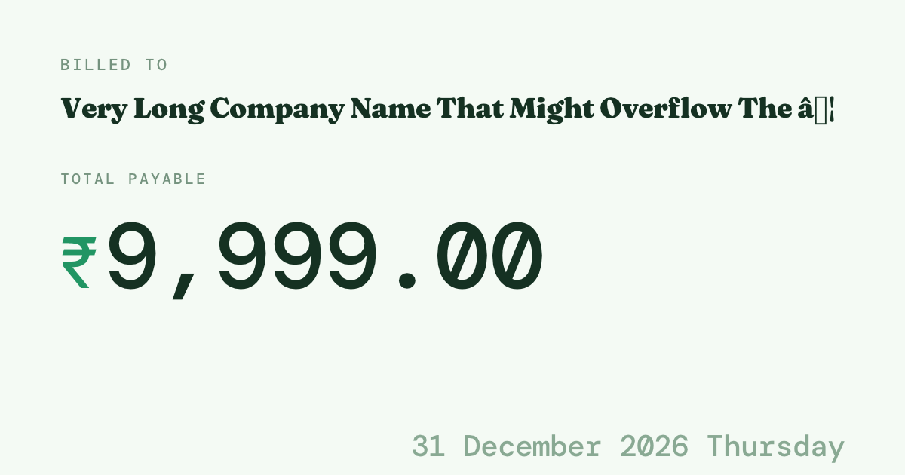</a>
</div>

<div>
  <a href="test_out/11_superlong_suffix.png">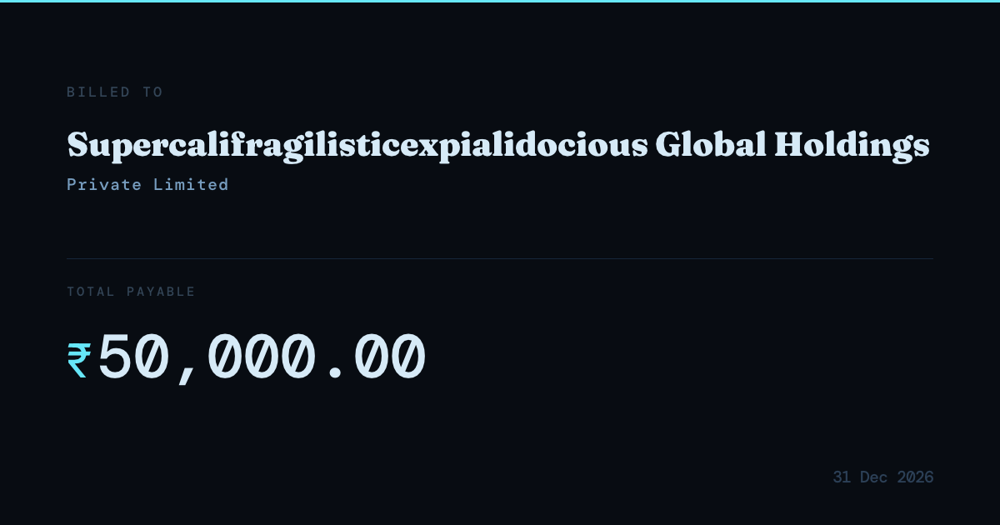</a>
  <a href="test_out/12_minimal.png">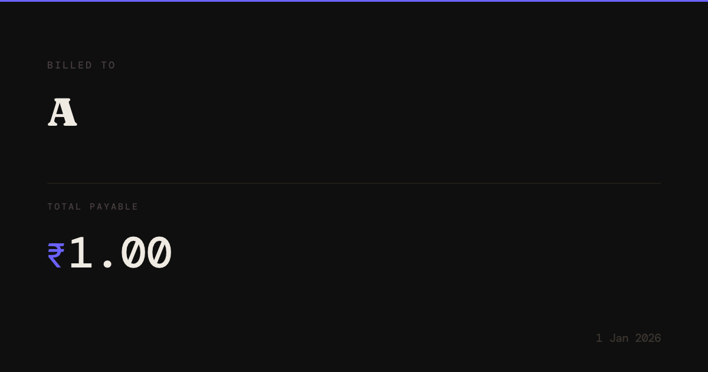</a>
</div>

**Color selection (theme) logic**

The renderer chooses a theme using the following logic (see `src/themes.cpp`):

- If the client provides an explicit `theme_id` (4th tab field in the request), that theme is used directly (e.g. `dark-purple`, `light-ivory`, etc.).
- Otherwise the project uses an amount-based ladder. The request `amount` string is parsed into paise (₹ × 100) using `parse_amount_to_paise()` and mapped to one of six dark themes by threshold:
  - < ₹1,000      → `dark-purple`
  - < ₹10,000     → `dark-emerald`
  - < ₹50,000     → `dark-amber`
  - < ₹1,00,000   → `dark-ice`
  - < ₹5,00,000   → `dark-rose`
  - ≥ ₹5,00,000   → `dark-slate`

The theme entries define a full palette used by the renderer (background, accent, label, name, amount colours, divider, date colour, and rupee/amount colours). Light-themed variants are also available if you explicitly select them by `theme_id`.

**License**
This project is released under the MIT License. See [LICENSE](LICENSE) for details.
